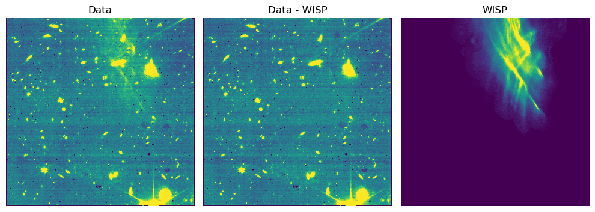
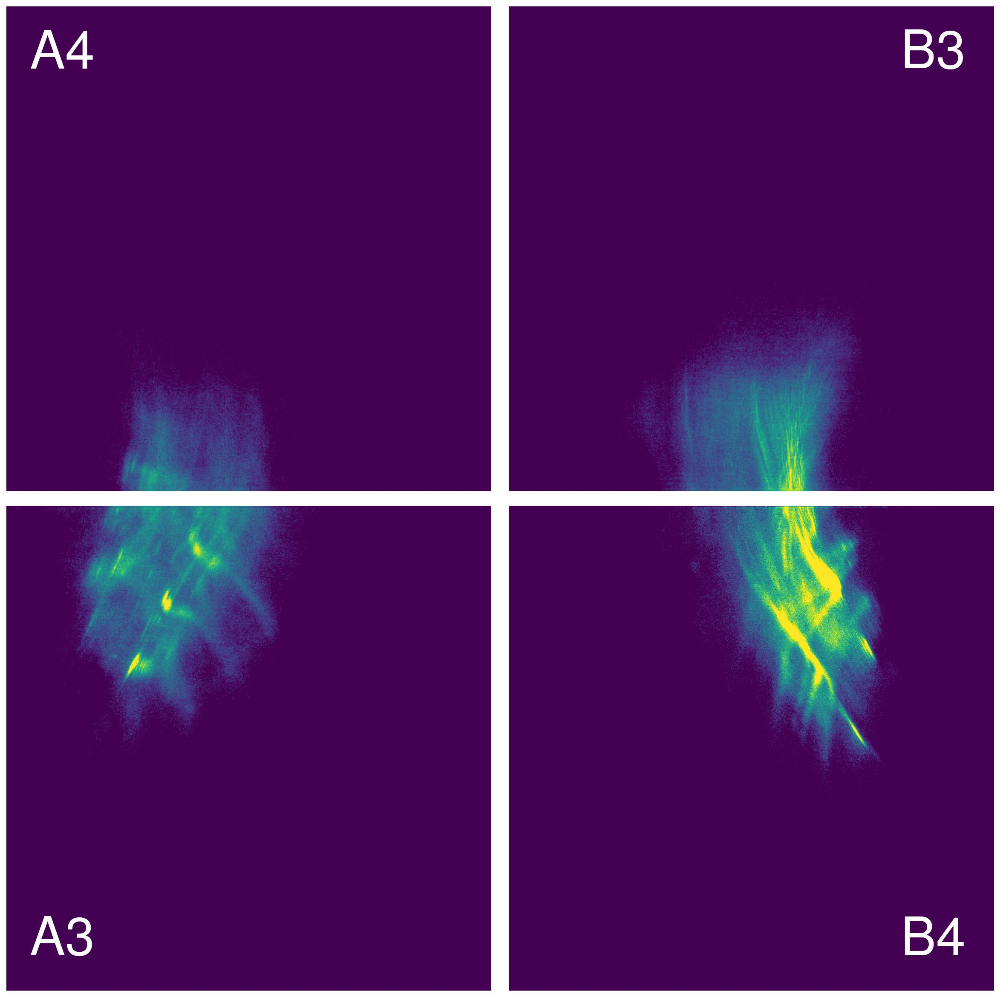

Purpose
-------
This package subtracts wisps from JWST/NIRCam images using data-driven, multi-component wisp templates. 

[Wisps](https://jwst-docs.stsci.edu/known-issues-with-jwst-data/nircam-known-issues/nircam-scattered-light-artifacts#:~:text=Figure%204.%20Claws%20and%20wisps
) are scattered light artifacts in JWST NIRCam images. They usually appear in the same locations on NIRCam detectors with mild morphological variation between observations.  Wisps are a significant source of contamination for objects fainter than 25 AB mag. 

We construct detector- and filter-specific wisp templates using the Non-negative Matrix Factorization (NMF) algorithm, based on extensive NIRCam data from JADES and other programs. This algorithm efficiently extracts wisp morphology and its principal modes of variations. The NMF-derived templates yield substantial improvement in wisp subtraction compared to existing single-template approaches

Implementation
------------

Wisp subtraction should be applied at [Stage 2 of the JWST data reduction pipeline](https://jwst-docs.stsci.edu/jwst-science-calibration-pipeline/stages-of-jwst-data-processing#gsc.tab=0).  For a single NIRCam detector, the runtime is about 0.4 seconds per exposure on one CPU core of an Apple M4 Pro. The runtime is 2 seconds when performing joint fitting with [1/f noise](https://jwst-docs.stsci.edu/known-issues-with-jwst-data/1-f-noise#gsc.tab=0).

The wisp templates are available at [link]. The main interface is the `fit_wisp` function in `nmfwisp.py`, which returns the best fit wisp model and its uncertainty. The only required user input is a source mask, which can be constructed from long-wavelength NIRCam images.

The `developer` directory contains code used to build the wisp template library. 

Installation
------------
1. If you have git installed, the code can be obtained with the following commands:

```bash
git clone https://github.com/zihaowu-astro/NMFwisp.git
cd NMFwisp
```
​	Alternatively, you can download the repository as a ZIP file from the [link](https://github.com/zihaowu-astro/NMFwisp/archive/refs/heads/main.zip).

2. Download the wisp template library and example data from the [link](https://github.com/zihaowu-astro/NMFwisp/releases/tag/v1.0). Please unzip/untar them before use. You can also download them from the command line (macOS/Linux)

```bash
curl -L -O https://github.com/zihaowu-astro/NMFwisp/releases/download/v1.0/nmfwisp-templates.tar.gz
curl -L -O https://github.com/zihaowu-astro/NMFwisp/releases/download/v1.0/example-data.tar.gz
```

Example
-------

```py
from astropy.io import fits
import matplotlib.pyplot as plt
import numpy as np

filter_name = 'F150W'
detector_name = 'nrcb4'
wisp_path = './library'

# Example file
filename = './data/jw01286001001_07201_00003_nrcb4_rate.fits'
maskfile = './data/jw01286001001_07201_00003_nrcb4_cal_bkgsub_tweak_smask-full.fits'

data = fits.open(filename)['SCI'].data
err  = fits.open(filename)['ERR'].data
mask = fits.open(maskfile)[0].data

# Fit wisps
from nmfwisp import fit_wisp
wisp, wisp_e = fit_wisp(data, err, mask, wisp_path, detector_name, filter_name, correct_1f=False)
```

Visualization of the wisp subtraction result:
```py
data0 = np.nan_to_num(data, nan=0.0) # remove nan values
fig, ax = plt.subplots(1, 3, figsize=(10, 4))
vmin, vmax = np.nanpercentile(data, 5), np.nanpercentile(data, 95)
ax[0].imshow(data0, origin='lower', vmin=vmin, vmax=vmax)
ax[0].set_title('Data')
ax[1].imshow(data0 - wisp, origin='lower', vmin=vmin, vmax=vmax)
ax[1].set_title('Data - WISP')
ax[2].imshow(wisp, origin='lower', vmin=0, vmax=np.nanpercentile(wisp, 99))
ax[2].set_title('WISP')
for a in ax:
    a.axis('off')
plt.tight_layout()
plt.show()
```



Wisp Morphology
------------




Citation
------------
If you use this code, please reference [this paper](https://arxiv.org/abs/2601.15958):
```
@ARTICLE{2026arXiv260115958W,
       author = {{Wu}, Zihao and {Johnson}, Benjamin D. and {Eisenstein}, Daniel J. and {Cargile}, Phillip and {Hainline}, Kevin and {Hausen}, Ryan and {Rinaldi}, Pierluigi and {Robertson}, Brant E. and {Tacchella}, Sandro and {Williams}, Christina C. and {Willmer}, Christopher N.~A.},
        title = "{JWST Advanced Deep Extragalactic Survey (JADES) Data Release 5: Wisp Subtraction with the Non-negative Matrix Factorization Algorithm}",
      journal = {arXiv e-prints},
     keywords = {Instrumentation and Methods for Astrophysics, Astrophysics of Galaxies},
         year = 2026,
        month = jan,
          eid = {arXiv:2601.15958},
        pages = {arXiv:2601.15958},
          doi = {10.48550/arXiv.2601.15958},
archivePrefix = {arXiv},
       eprint = {2601.15958},
 primaryClass = {astro-ph.IM},
       adsurl = {https://ui.adsabs.harvard.edu/abs/2026arXiv260115958W},
      adsnote = {Provided by the SAO/NASA Astrophysics Data System}
}
```