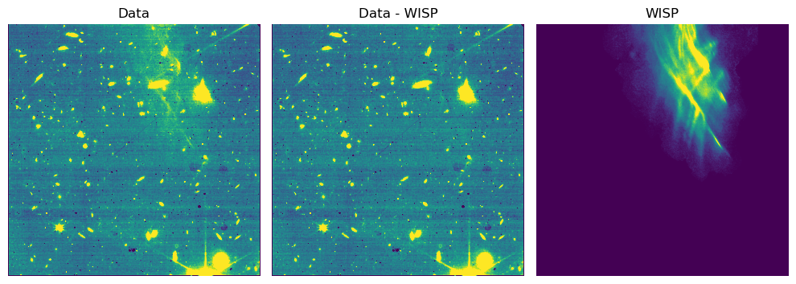
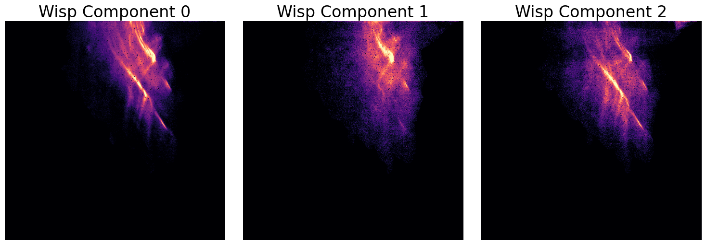
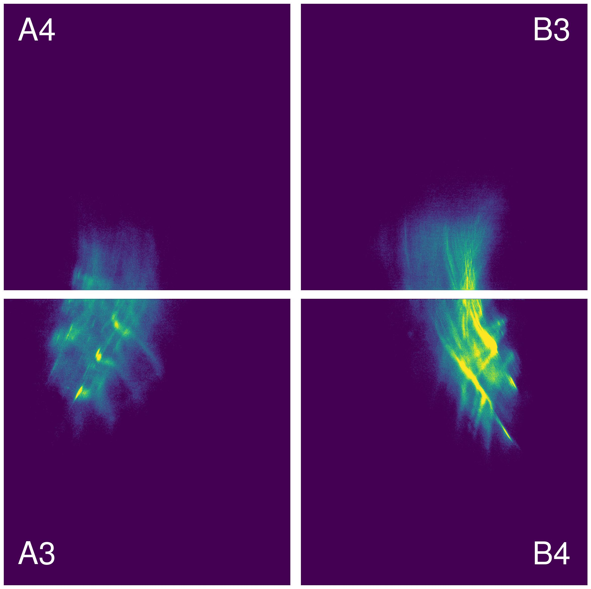

# NMFwisp

NMFwisp subtracts JWST/NIRCam wisp artifacts using multi-component,
detector- and filter-specific NMF templates.

For usage examples, source-mask generation, API details, developer notes, and
citation information, please see the documentation website:

https://zihaowu-astro.github.io/NMFwisp/

## Installation

Install from PyPI:

```bash
pip install nmfwisp
```

Development install from source:

```bash
git clone https://github.com/zihaowu-astro/NMFwisp.git
cd NMFwisp
pip install -e .
```

## Wisp Figures

Example wisp subtraction:



Multi-component NMF wisp features:



Wisp morphology in all contaminated NIRCam detectors:



## Reference

If you use NMFwisp, please cite the paper:

```bibtex
@ARTICLE{2026arXiv260115958W,
       author = {{Wu}, Zihao and {Johnson}, Benjamin D. and {Eisenstein}, Daniel J. and {Cargile}, Phillip and {Hainline}, Kevin and {Hausen}, Ryan and {Rinaldi}, Pierluigi and {Robertson}, Brant E. and {Tacchella}, Sandro and {Williams}, Christina C. and {Willmer}, Christopher N.~A.},
        title = "{JWST Advanced Deep Extragalactic Survey (JADES) Data Release 5: Wisp Subtraction with the Non-negative Matrix Factorization Algorithm}",
      journal = {arXiv e-prints},
     keywords = {Instrumentation and Methods for Astrophysics, Astrophysics of Galaxies},
         year = 2026,
        month = jan,
          eid = {arXiv:2601.15958},
        pages = {arXiv:2601.15958},
          doi = {10.48550/arXiv.2601.15958},
archivePrefix = {arXiv},
       eprint = {2601.15958},
 primaryClass = {astro-ph.IM},
       adsurl = {https://ui.adsabs.harvard.edu/abs/2026arXiv260115958W},
      adsnote = {Provided by the SAO/NASA Astrophysics Data System}
}
```
